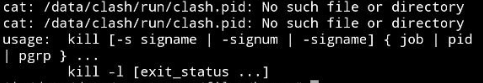
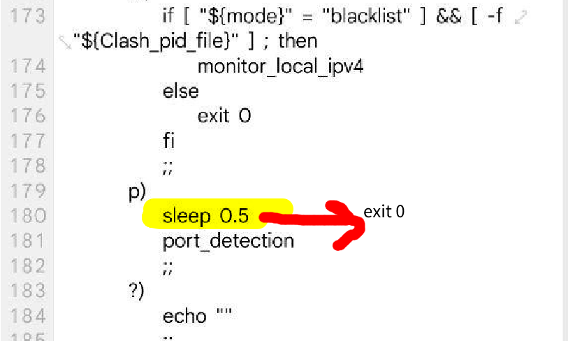
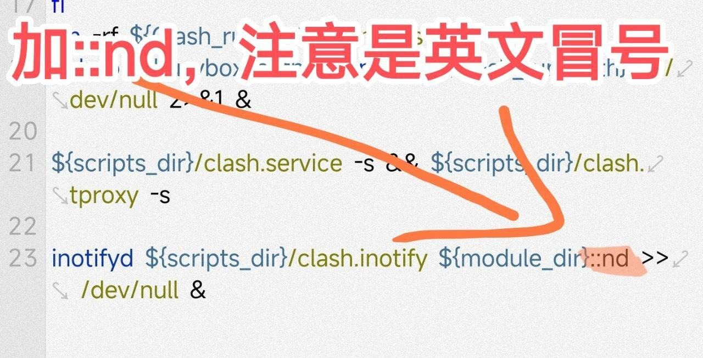

# 常见问题

## 声明变量 <a href="#var" id="var"></a>

### 由于三个版本目录不尽相同，所以开篇先声明变量 <a href="#undefined" id="undefined"></a>

### **原版** <a href="#undefined" id="undefined"></a>

```bash
su
script_dir=/data/adb/modules/Clash_For_Magisk/scripts
bin_path=/data/adb/modules/Clash_For_Magisk/system/bin/clash
```

### **魔改1** <a href="#undefined" id="undefined"></a>

```bash
su
script_dir=/data/clash/scripts
bin_path=/data/clash/kernel/clash
```

### **魔改2** <a href="#undefined" id="undefined"></a>

```bash
su
script_dir=/data/clash/scripts
bin_path=/data/adb/modules/Clash_For_Magisk/system/bin/clash
```

### 按照自己的版本执行命令后才能执行下面的指令 <a href="#undefined" id="undefined"></a>

## **问题1:No such file or directory** <a href="#q1" id="q1"></a>

`${script_dir}/clash.service -s` 后输出如下



**方法**

执行`${bin_path} -d /data/clash/ -t -f /data/clash/config.yaml`根据错误输出改文件

## 问题2:配置合并失败或卡死 <a href="#q2" id="q2"></a>

`${script_dir}/clash.service -s` 后输出配置文件合并失败或卡死

**方法**

三个方法

* 魔改版2-V4.8已修复卡死问题，可刷入尝试
* 在config.yaml文件末尾插入几十行注释，增加文件体积
* 抄魔改2的`${script_dir}/clash.service`的代码（有bash基础的话不建议如此操作）

## 问题3:端口未检测到 <a href="#q3" id="q3"></a>

`/data/clash/run/run.logs`提示端口未检测到，已停止内核

**方法**

按顺序检查

1. 执行`${bin_path} -d /data/clash/ -t -f /data/clash/config.yaml`根据错误输出改文件
2. **别开着别的代理启动CFM，尤其是CFA**
3. 判断文件`/data/clash/run/config.yaml`是否存在，不存在则见_**问题2**_
4. 执行`${bin_path} -d /data/clash/ -t -f /data/clash/run/config.yaml`根据错误输出改`/data/clash/template`
5. 执行 **** `${bin_path} -d /data/clash/ -f /data/clash/run/config.yaml`根据输出判断有无端口占用，改`template`相应端口
6. 使用`ss -h`判断手机有无ss命令

* 有： 群里提问尝试解决
* 无： 改`${script_dir}/clash.tool`162行(魔改2为180行)改`sleep *`**(\*为任意数字)**为**`exit 0`**



## 问题4:DashBoard无法控制启停 <a href="#q4" id="q4"></a>

DashBoard无法控制启停

**方法**

更换DB，见[控制方法](broken-reference)部分

## 问题5:所有软件没网 <a href="#q5" id="q5"></a>

内核已启动，但是没有网络

**方法**

**顺序检查**

1. 如果装了魔改版，请确定自己已经更新订阅
2. 更换节点
3. 尝试`global`模式
4. 附上**内核启动后**的`iptables -nvL -t mangle`的输出在群里提问

## 问题6:墙外网站没网 <a href="#q6" id="q6"></a>

内核已启动，墙外网站比如Google、YouTube、Fackbook、GitHub等网站无法连接

**方法**

* 尝试其它节点
* 尝试`global`模式
* 尝试`fake-ip`模式，具体参见[enhanced-mod](broken-reference)

## 问题7:源地址全为ip,概率没网 <a href="#q7" id="q7"></a>

clash连接日志里显示的所有连接源为ip地址, 规则无法生效且有概率无法上网

**方法**

请关闭系统和浏览器的**安全DNS**(有的系统也称之为**私人DNS**)和相关DNS模块或者应用后重启模块再次尝试

## 问题8:热点没网 <a href="#q8" id="q8"></a>

设备开启热点共享连接设备无网络

**方法**

请保持`allow-lan: true`且保证dns监听地址由`127.0.0.1`改为`0.0.0.0`.可在控制面板临时打开亦可在template文件中更改. 可能还需要打开至少socks端口、http端口、mixed端口之一，具体请参见[config.yaml教材](broken-reference)

## 问题9:无法用Magisk启停 <a href="#q9" id="q9"></a>

原版在Android下无法用Magisk启停

**方法**

改`/data/adb/modules/Clash_For_Magisk/service.sh`如下图：

如果**能停不能启**，删掉一个冒号`:nd`~~（只能说手机与手机的体质不能一概而论~~


